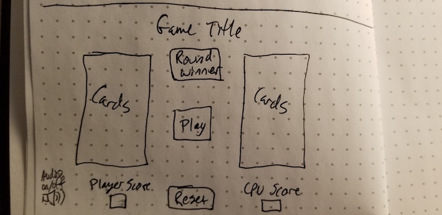

# War-Game
## War Browser Card Game

This is the card game War.  Each player plays a card, the higher of the two cards wins and puts both cards into their deck.  If the card values are equal, each player plays three cards face down then one card face up.  Whichever card is higher wins and puts all of the cards in their hand.  The first player to get all the cards wins the game.  While the logic to play this game in the browser is included in the code and is functional, it was determined that it would take too long to play this way for a browser game.  For this game, whoever has the highest score once all 26 cards have been played is the winner.

## Game Images

## Technology Used
HTML
CSS
JavaScript

https://thejoo44.github.io/War-Game/

## Pseudocode

1. define constants
    1. player
    2. computer
    3. audio elements
    4. cards array(numbers, suits)
2. define variables
    1. shuffled cards
    2. player deck
    3. computer deck
    4. player score
    5. computer score
    6. round winner
    7. game winner win/lose/tie
3. cache elements
    1. player deck
    2. computer deck
    3. player score
    4. computer score
    5. round winner
    6. audio button
    7. reset button
    8. card images
4. event listeners
    1. play button click(done)
    2. reset button click(done)
    3. audio button click(done)
5. write functions
    1. Make Deck - combine the numbers and suits arrays into a deck(done)
    2. Shuffle Cards - randomize 4 sets of 13 cards into an array matching suits to values
    3. Deal Cards - split cards array into player card array and computer card array
    4. Play Cards - on play button click deal the first card value from each array and compare them
        1. call Compare Cards - compare the number value of cards to find a round winner 
        2. call Round Winner - update the round winner variable
        3. call Game Winner - after all cards have been played compare player score and computer score to determine game winner
        4. call render function
    5. Replay Button - reshuffle and deal all cards out to both players, reset scores, set round winner to none
    6. Initializer Function - set up game
    7. Render Function - check matches, check round/game winner, declare round/game winner 
